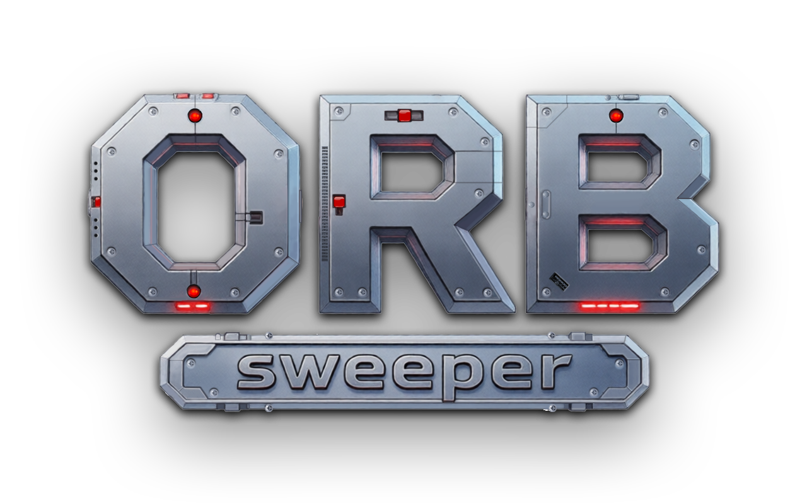

<center></center>

# Orb Sweeper

Minesweeper on a 3D sphere. Instead of a flat grid, the board is a Goldberg polyhedron — a sphere tiled with hexagons and twelve pentagons — that you rotate and zoom with touch or mouse.

Built with **Godot 4.6** and **GDScript**, targeting Android (portrait, 400×800) and desktop.

## Gameplay

Classic minesweeper rules on a closed surface:

- Numbers count adjacent mines across the hex/pent tiling
- First tap is always safe (BFS-cleared opening)
- Flagging locks a cell; chording on a satisfied number reveals remaining neighbors
- Clear every non-mine face to win

### Controls

| Action  | Desktop                       | Touch                  |
|---------|-------------------------------|------------------------|
| Reveal  | Left-click                    | Tap                    |
| Flag    | Right-click                   | Long-press (0.4s)      |
| Chord   | Click a revealed number       | Tap a revealed number  |
| Orbit   | Drag                          | One-finger drag        |
| Zoom    | Scroll                        | Pinch                  |

A drag threshold of 8 px separates clicks from orbits.

### Difficulty

Two parameters drive difficulty, stored in the `GameConfig` autoload:

- `subdivision` (1–10) — sphere density. Face count is `10·s² + 2` (s=3 → 92, s=5 → 262, s=9 → 812).
- `density` (0.05–0.5) — fraction of faces containing mines.

Presets: **Easy** (s=3, 15%), **Normal** (s=5, 20%), **Hard** (s=7, 25%). Custom games and per-preset high scores are persisted to `user://records.json` via `RecordsManager`.

## Architecture

### Scenes

- `scenes/main.tscn` — menu hub (new game, custom, records, settings)
- `scenes/game.tscn` — gameplay: sphere, orbit camera, HUD, renderers

### Scripts (`scripts/`)

Scripts are organized into subdirectories by concern:

- **`game/`** — core gameplay logic
  - `spherical_minesweeper.gd` — game controller: input dispatch, mine placement (Fisher-Yates with BFS safe zone), flood-fill reveal, win/lose, chording
  - `game_input_handler.gd` — input routing and raycasting
  - `game_menu_controller.gd` — in-game pause/win/loss overlay
  - `mine_placer.gd` — mine layout generation helpers
  - `no_guess_generator.gd` — solver-based no-guess board generation
- **`geometry/`** — Goldberg polyhedron mesh and data
  - `goldberg_polyhedron.gd` — procedural mesh: icosahedron → subdivision → dual graph → hex/pent faces
  - `goldberg_cell_manager.gd` — 1×N R8 data texture encoding per-face state (0–5)
  - `sphere_collider_setup.gd` — physics collider attachment
- **`rendering/`** — visual rendering, camera, and FX
  - `cell_number_renderer.gd`, `flag_renderer.gd`, `mine_renderer.gd` — MultiMeshInstance3D renderers (single draw call each)
  - `orbit_camera.gd` — quaternion-based camera with inertia and pinch-to-zoom
  - `explosion.gd`, `explosion_spawner.gd` — mine detonation FX
- **`ui/`** — menu screens and HUD
  - `main_screen_controller.gd` — main menu navigation
  - `screen_new_game.gd`, `screen_custom_game.gd`, `screen_records.gd`, `screen_settings.gd`, `screen_about.gd` — menu screens
  - `status_bar.gd`, `no_guess_hud.gd`, `record_card.gd`, `menu_sphere.gd` — HUD and decorative elements
- **`autoload/`** — singleton services (registered in `project.godot`)
  - `settings_store.gd`, `audio_manager.gd`, `haptics_manager.gd`, `background_manager.gd`, `game_config.gd`, `records_manager.gd`
- **`util/`** — pure utilities
  - `difficulty_presets.gd`, `time_formatter.gd`

### Rendering

Three GPU-driven layers, each a single draw call:

1. **Base sphere** — `shaders/goldberg_cell.gdshader` reads the state texture for per-face color, height displacement, fresnel glow, bevel shadows, and seam lines.
2. **Numbers** — `cell_number_renderer.gd` + `shaders/cell_number.gdshader`: a `MultiMeshInstance3D` of camera-facing quads with bitmap digit patterns.
3. **Flags / mines** — `flag_renderer.gd`, `mine_renderer.gd`: `MultiMeshInstance3D` instances. The flag mesh uses vertex color R to separate the static pole from the animated cloth.

Face picking uses Jolt Physics raycasting, then resolves the exact face by max dot-product to face centers.

### Shaders (`shaders/`)

- `goldberg_cell.gdshader` — state-driven sphere surface
- `cell_number.gdshader` — billboard digits
- `flag.gdshader` — cloth animation
- `mine.gdshader`, `outline3.gdshader` — mine model + outline

## Running

Open `project.godot` in Godot 4.6 and press Play. The main scene is `scenes/main.tscn`.

### Android build

Export presets target `armv7a` and `arm64-v8a` with ETC2/ASTC texture compression. The APK is written to `../orb-sweeper.apk`.

## Project layout

```
scenes/      main menu + game scenes
scripts/     game logic, geometry, rendering, UI, autoloads, utilities
shaders/     surface, digits, flag, mine
objects/     meshes (flag, mine, etc.)
materials/   shared ShaderMaterials
textures/    UI + mesh textures
fonts/       UI fonts
sounds/      SFX
ui_styles/   StyleBox resources
android/     export template config
```

## Conventions

- Mobile rendering backend; ETC2/ASTC compression
- Jolt Physics for 3D raycasting
- Sphere radius scales with subdivision: `radius = subdivision * 2.0`
- Adjacency stored as flat arrays for cheap BFS
